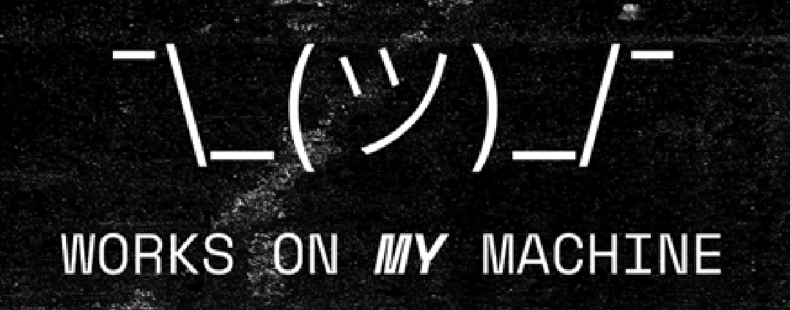

# Overview
This module gives you hands-on experience fixing bugs in Temporal code.

Nobody is perfect: sometimes we make mistakes in our code. Temporal can't keep your code from failing or crashing, but it _can_ make it easier to deal with when this happens.

Building on the application from Module 3, we're going to pretend that another developer, Jerry, made some changes to our code and pushed them. We'll run the code with Jerry's changes and work through some errors.

We'll explore how breaking bugs in Workflows and Activities work, and how we can fix them.



<p align="center"><em>Sometimes you have to deal with broken code.</em></p>

## Learning Objectives
1. Explore breaking bugs in Workflow code
2. Explore breaking bugs in Activity code
3. Understand the difference between Workflow and Activity breaking bug behavior
4. Fix a breaking Workflow bug
5. Fix a breaking Activity bug


Exercise Steps
===

## Step 1: Setup

1. In [button label="Terminal 1" background="#444CE7"](tab-0), run the included script that will start three things: 1) the `account_api` we used before, 2) the Temporal worker we used before, and 3) a new API called `money_transfer_api` that helps to facilitate communication between a new UI and money transfer actions - which are in this case Temporal Workflow actions.
```bash,run
./start_services.sh
```

The output of this script will show the Workflow and Activity logger statements as you start money transfer Workflows.

Feel free to take a look at the new API in the [button label="Code Editor" background="#444CE7"](tab-2) in the exercises/module03 folder!

## Step 2: Run Transfers, Workflow Breaking Bugs
Go to the [button label="Money Transfer UI" background="#444CE7"](tab-1), and move some money around.

It's fine to do Real World Mode, but it'll be a bit simpler if you leave it off. Choose the level of chaos you prefer.

Take a look at the workflows in the [button label="Temporal UI" background="#444CE7"](tab-3) - note that Workflows are failing. Explore the exception.

 (#TODO Laine maybe add a link to the code editor here?)
Look at the Workflow code, can you find the problem?

<details>
<summary>Hint (click to reveal)</summary>

Check out the code Jerry added after checking account balance.

</details>

<br />
Fix Jerry's code, then restart the worker process.

As we saw when we crashed things in Module 1, Temporal Workflows will pick back up where they left off.
Workflow task failures are retried forever until the Workflow succeeds or is ended.
<br /><br />
Now that the Workflows can proceed, it will finish the Workflow task and continue.

## Step 3: Activity Breaking Bugs
Now you may notice that the Withdraw Activity is continually failing. Check out `activities.py` - let's see what is happening. Perhaps Jerry has made some changes here too?


<details>
<summary>Hint (click to reveal)</summary>

Check out the code Jerry changed in the `withdraw()` Activity.

</details>

<br />
Fix the Activity, restart the worker process, and see that Temporal picks up the latest Activity code and succeeds.
<br /><br />
Nice work!

## Step 4: Details of Temporal Bug Handling
### Bugs in Workflow Code
Temporal keeps process state automatically, and always retries Workflow Task Failures.
If all Workflows are stuck on a bug step, fixing these Workflow failure can be as simple as fixing the code and redeploying it.

### Bugs in Activity Code
Temporal by default retries Activities indefinitely. If you have an Activity that is broken and keeps retrying, you can see the failure info in the UI, including the line of code, fix the code, add tests and pass tests, and then deploy the fixed code. Temporal will then execute the Activities. It might be a while - usually retry backoff settings are relevant here.

This auto-bug-fixing behavior is one reason to keep unlimited retries defaults for your Activities.
If your business process requires succeeding or failing in a limited time, or you don't want to call an expensive API many many times, or you want to fail your processes for other reasons after a number of calls, it's fine to limit retries - but you lose this neat behavior.

## Step 5: Wrap-up and Questions
Temporal makes handling bugs simpler and clearer. Temporal applications keep state automatically, and automatically try to progress once to completion.
<br /><br />
In our experience with non-Temporal systems, this has gone very different. When there's a transaction- or process-breaking bug, it can cause things to stop in the middle with no possibility of restart. So in addition to finding and fixing the code, we have had to restart processes from the beginning, get data in sync in multiple different queues and databases, and clean up duplicate entries. Yikes!


<br />
It's nice to know that even thow I'm not perfect, Temporal can help me fix issues.
<br /><br />
In a later section, we'll take a look at the unique ways we can test Temporal code so we won't even have these kinds of errors.

### Questions for thought:
- What happens when there is a bug in Workflow code? How is that different than non-Temporal Code?
- What happens when you fix a bug in Workflow code?
- What happens when there is a bug in Activity code? How is that different than non-Temporal Code? What happens when you fix Activity Bugs?
- Think back to some bugs you've fixed. Did they cause any problems beyond application errors?
- How would the experience be different if they were bugs in Workflow code? Activity Code?

### Further Learning for More Complex Errors
Even if your Workflows and Activities aren't hard-stuck, there are some other neat things you can do with Temporal to fix errors. If you like and time allows, dig into the following content:
 - If some Workflows are past the bug step -- if it breaks some Workflows but not all -- take care to [version](https://docs.temporal.io/develop/python/versioning) the change so that Workflows past this step will not have a breaking change.
<br /><br />
 - It might be useful to mention Workflow Reset as well - you can _"time travel"_ your Workflows back to a certain step using [Workflow Reset](https://patford12.medium.com/batch-reset-with-temporal-f895a8b8408b) - so if they've failed out their Activity Retry policy and failed the Workflow.
